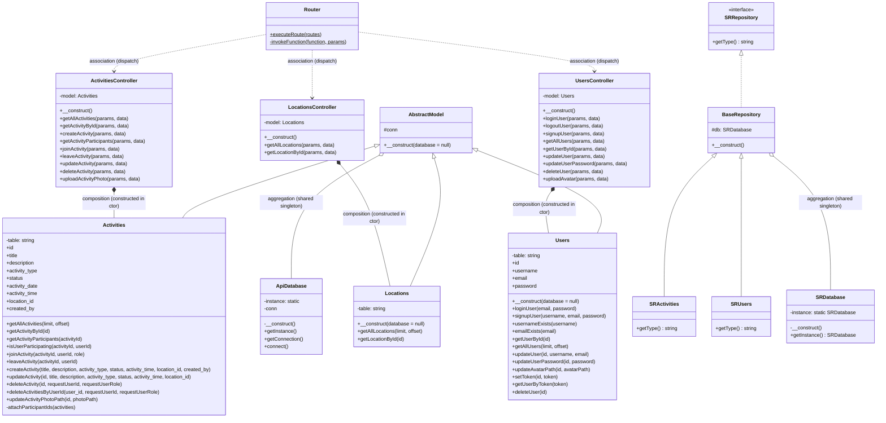

```mermaid

classDiagram

  

%% ========================

%% API domain (public/api)

%% ========================

class Router {

  +executeRoute(routes)$

  -invokeFunction(function, params)$

}

  

class ApiDatabase {

  -instance: static

  -conn

  -__construct()

  +getInstance()

  +getConnection()

  +connect()

}

  

class AbstractModel {

  #conn

  +__construct(database = null)

}

  

class Activities {

  -table: string

  +id

  +title

  +description

  +activity_type

  +status

  +activity_date

  +activity_time

  +location_id

  +created_by

  +getAllActivities(limit, offset)

  +getActivityById(id)

  +getActivityParticipants(activityId)

  +isUserParticipating(activityId, userId)

  +joinActivity(activityId, userId, role)

  +leaveActivity(activityId, userId)

  +createActivity(title, description, activity_type, status, activity_time, location_id, created_by)

  +updateActivity(id, title, description, activity_type, status, activity_time, location_id)

  +deleteActivity(id, requestUserId, requestUserRole)

  +deleteActivitiesByUserId(user_id, requestUserId, requestUserRole)

  +updateActivityPhotoPath(id, photoPath)

  -attachParticipantIds(activities)

}

  

class Locations {

  -table: string

  +__construct(database = null)

  +getAllLocations(limit, offset)

  +getLocationById(id)

}

  

class Users {

  -table: string

  +id

  +username

  +email

  +password

  +__construct(database = null)

  +loginUser(email, password)

  +signupUser(username, email, password)

  +usernameExists(username)

  +emailExists(email)

  +getUserById(id)

  +getAllUsers(limit, offset)

  +updateUser(id, username, email)

  +updateUserPassword(id, password)

  +updateAvatarPath(id, avatarPath)

  +setToken(id, token)

  +getUserByToken(token)

  +deleteUser(id)

}

  

class ActivitiesController {

  -model: Activities

  +__construct()

  +getAllActivities(params, data)

  +getActivityById(params, data)

  +createActivity(params, data)

  +getActivityParticipants(params, data)

  +joinActivity(params, data)

  +leaveActivity(params, data)

  +updateActivity(params, data)

  +deleteActivity(params, data)

  +uploadActivityPhoto(params, data)

}

  

class LocationsController {

  -model: Locations

  +__construct()

  +getAllLocations(params, data)

  +getLocationById(params, data)

}

  

class UsersController {

  -model: Users

  +__construct()

  +loginUser(params, data)

  +logoutUser(params, data)

  +signupUser(params, data)

  +getAllUsers(params, data)

  +getUserById(params, data)

  +updateUser(params, data)

  +updateUserPassword(params, data)

  +deleteUser(params, data)

  +uploadAvatar(params, data)

}

  

AbstractModel <|-- Activities

AbstractModel <|-- Locations

AbstractModel <|-- Users

AbstractModel o-- ApiDatabase : aggregation (shared singleton)

ActivitiesController *-- Activities : composition (constructed in ctor)

LocationsController *-- Locations : composition (constructed in ctor)

UsersController *-- Users : composition (constructed in ctor)

Router ..> ActivitiesController : association (dispatch)

Router ..> LocationsController : association (dispatch)

Router ..> UsersController : association (dispatch)

  

%% ======================================

%% School requirements demo (separate set)

%% ======================================

class SRRepository {

  <<interface>>

  +getType() string

}

  

class SRDatabase {

  -instance: static SRDatabase

  -__construct()

  +getInstance() SRDatabase

}

  

class BaseRepository {

  #db: SRDatabase

  +__construct()

}

  

class SRActivities {

  +getType() string

}

  

class SRUsers {

  +getType() string

}

  

SRRepository <|.. BaseRepository

BaseRepository <|-- SRActivities

BaseRepository <|-- SRUsers

BaseRepository o-- SRDatabase : aggregation (shared singleton)

```
